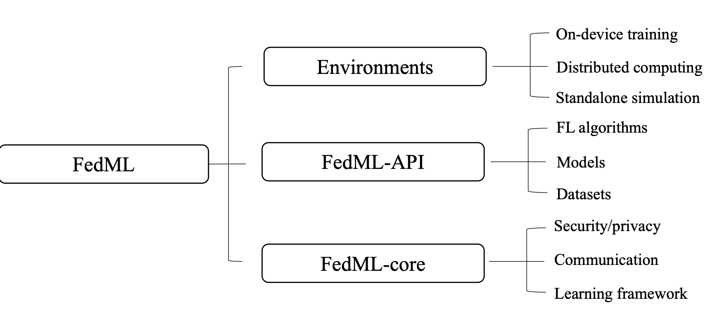

# Project Overview

## Project Introduction

Federated learning is a machine learning technique that trains a model across multiple decentralized edge devices or servers holding local data samples without sharing data, thus allowing it to address critical issues such as data privacy, security, access rights, and access to heterogeneous data. Its applications are spread over several industries.&#x20;

<figure><figcaption></figcaption></figure>

One related area with FL is edge computing, where the parties are edge devices. Many studies try to integrate FL with mobile edge systems. The clients (e.g., an app running on mobile phones) store the necessary training data locally (with limited time and quantity). In many cases, the app will already have stored this data (e.g., a text messaging app must store text messages, and a photo management app already stores photos). However, in some cases, additional data or metadata might need to be maintained, e.g., user interaction data, to provide labels for a supervised learning task.

<figure><figcaption>
The comparison among some existing FL platforms
</figcaption></figure>

This project is to build an FL platform with FedML. This platform involves wireless networks (e.g., 5G, WIFI), edge devices (e.g., mobile phones, wearable devices, and IoTs), and benchmark algorithms implementation. Future work will be conducted based on this platform, e.g., experiment/analysis on statistical/system heterogeneity, more benchmark implementation, and privacy/security techniques.

<figure><figcaption>
FedML Structure
</figcaption></figure>

## Process Overview&#x20;

<table><thead><tr><th>Timeline</th><th>Subworks</th><th data-type="users" data-multiple>Contributors</th><th>Progress</th></tr></thead><tbody><tr><td></td><td><a href="fedml-platform/project-overview/subwork-template.md">Subwork Template</a></td><td></td><td>100/100</td></tr><tr><td>During Semester</td><td>Pre-requisite: <a href="fedml-platform/project-overview/fedml-simulations.md">FedML simulations</a></td><td></td><td>--</td></tr><tr><td>During Semester</td><td>Pre-requisite: Simulation Implementation with Different Experimental Settings</td><td></td><td>0/100</td></tr><tr><td>1st month (Summer)</td><td>Deployment on Android</td><td></td><td>0/100</td></tr><tr><td>1st  month (Summer)</td><td>Deployment on IoTs</td><td></td><td>0/100</td></tr><tr><td>2nd month (Summer, 1~2 weeks)</td><td>Test Platform</td><td></td><td>0/100</td></tr><tr><td>Before summer ends</td><td>Implementation of Additional algorithms (Simulation + cross-devices)</td><td></td><td>0/100</td></tr></tbody></table>

## Conclusion
