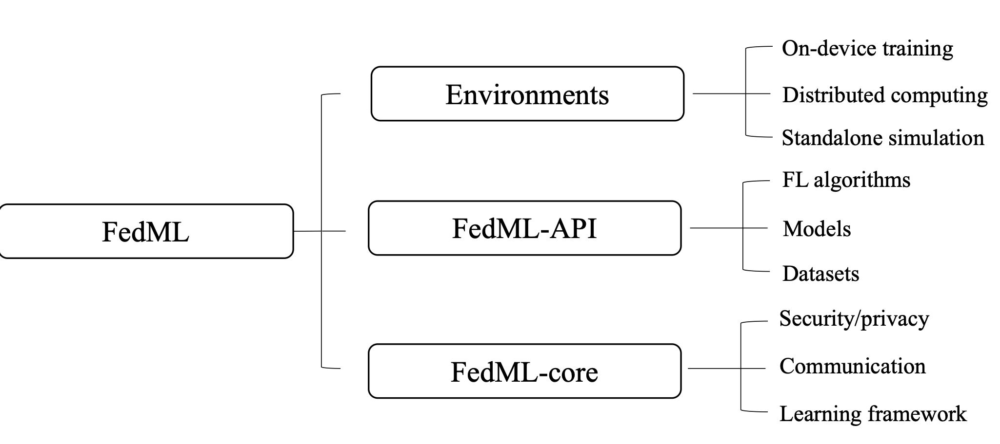

# Android Platform

## Plan

**Android client app:** Single Kotlin app shipped to the user.

* Data gathering: UI, user data collection and handling, and HTTPS client in Kotlin.
* ML: Call FedML's Java API from Kotlin for local training (Kotlin has first-class Java interoperability).

**Server**: Single modular Python server with a single database.

* Python is the language of choice to best support ML exploration.
* ML module:
  * Call FedML's Python API from the server for aggregation.
* Web module: gather and store data.
  * Django for HTTPS server and database interface (ORM).
  * PostgreSQL for the database.

HTTPS does not support broadcasting; we cannot assume the clients would always be on. So, I assume the clients will occasionally poll the server for new information. We only need to implement a REST API or something equivalent for communication.

