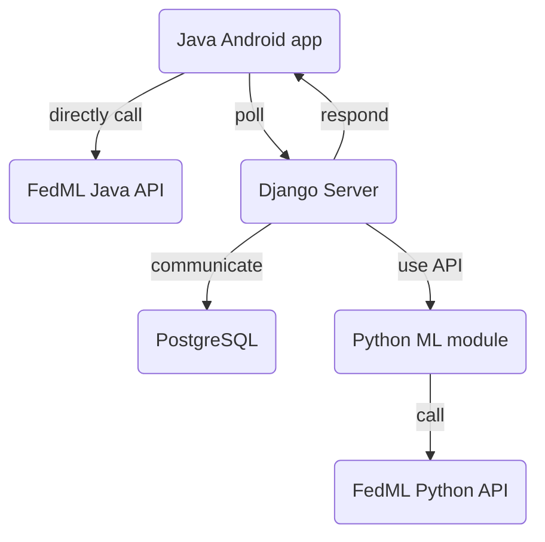

# Subwork\_Sichang

## Recommended Android Developer Tutorials

- [x] [Build Your First Android App in Java](https://developer.android.com/codelabs/build-your-first-android-app?hl=en#0)
- [ ] [Video: Android Development for Beginners](https://www.youtube.com/watch?v=fis26HvvDII)
- [ ] [Android Room with a View](https://developer.android.com/codelabs/android-room-with-a-view#0)
- [ ] [Background Work with WorkManager](https://developer.android.com/codelabs/android-workmanager-java#0)

### More Android resources

- [javaTpoint](https://www.javatpoint.com/android-tutorial)
- [GeeksforGeeks](https://www.geeksforgeeks.org/android-tutorial/)
- [Codelabs](https://codelabs.developers.google.com/?cat=android&text=android%20java)

<details>
<summary>Useless resources since we are not going to use Kotlin.</summary>

- [x] [Build your first app](https://developer.android.com/training/basics/firstapp)
- [ ] [Training courses](https://developer.android.com/courses)
    - [x] [Android Basics with Compose](https://developer.android.com/courses/android-basics-compose/course)
    - [x] [Android Basics in Kotlin](https://developer.android.com/courses/android-basics-kotlin/course)
    - [ ] [Jetpack Compose for Android developers](https://developer.android.com/courses/jetpack-compose/course)
    - [ ] [Modern Android app architecture](https://developer.android.com/courses/pathways/android-architecture)
    - [ ] [Kotlin coroutines](https://developer.android.com/courses/pathways/android-coroutines)
- [ ] [Connectivity](https://developer.android.com/guide/topics/connectivity)
- [ ] [Testing](https://developer.android.com/training/testing)
- [ ] [Security best practices](https://developer.android.com/topic/security/best-practices)

</details>

## Up till now

- Tried Retrofit and made blocking GET request not in strict mode.

<details>
<summary>Dependency settings.</summary>

```xml
<!-- AndroidManifest.xml -->
    <uses-permission android:name="android.permission.INTERNET" />
    <uses-permission android:name="android.permission.ACCESS_NETWORK_STATE" />
```

```gradle
// build.gradle
implementation 'com.squareup.retrofit2:retrofit:2.9.0'
implementation 'com.squareup.retrofit2:converter-gson:2.9.0'
implementation 'com.google.code.gson:gson:2.10.1'
```

</details>

- Tried Retrofit with [RxAndroid][RxAndroid] and [RxJava][RxJava] for
    non-blocking requests.

<details>
<summary>Using RxJava for non-blocking IO.</summary>

```gradle
// build.gradle
implementation 'io.reactivex.rxjava3:rxandroid:3.0.2'
implementation 'io.reactivex.rxjava3:rxjava:3.1.5'
```

```java
Flowable.fromCallable(someIoTaskFunction)
    .subscribeOn(Schedulers.io())
    .observeOn(AndroidSchedulers.mainThread())
    .subscribe(
        // What to do on the main thread after `someIoTaskFunction` returns.
        functionOnSuccess, functionOnFailure));
```

</details>

- Tried supporting Kotlin in existing Java app and calling Kotlin from Java.
    [Commit](https://github.com/SichangHe/learn_program/commit/563205ca8f812848391b6cfc5033a587707a7b16).
    [Answer on StackOverflow](https://stackoverflow.com/a/75702627/17800723).
    Very minimal changes and easy.
- Set up test repository
    [AndroidClient_django_server_POC][client-server-test-repo].

## Up till 2023/3/9

- Looked for Android HTTPS client resources.
    - [Perform network operations
        overview][perform-network-operations-overview] from Android developers.
    - ~~[Ktor][ktor] the Kotlin HTTPS client/server library.~~
    - Android HTTPS client [Retrofit][retrofit].
    - [android/connectivity-samples][android-connectivity-samples],
        a Git repository of code samples.

- Checked out the previous Android app `FedC`.
    - The app architecture is similar in Java, although the UI uses XML.
    - `org.eclipse.paho.client.mqttv3` handles MQTT.
    - The connection blocks the main thread, causing UI lag.
- Nuked Kotlin and related work out of the plan.
- Looked for Android developers tutorial for Java instead.
    - Hard to find because most are in Kotlin.

## Up till 2023/03/05

- Read FedML background materials.
- Ran FedML demo Python simulation.
- Tried Android Studio, Kotlin, JetPack Compose.
- Sketched tech stack plan for the Android platform.

<details>
<summary>Java + FedML Java API, Django + FedML Python API + PostgreSQL, HTTPS poll</summary>

Jiaqi asked me for a formal tech stack plan for the Android platform, here is my current sketch:

Android client app: Single Java app shipped to the user.

- Data gathering: UI, user data collection and handling, and HTTPS client in Java.
- ML: Call FedML's Java API for local training.

Server: Single modular Python server with single database.

- Python as language of choice to best support ML exploration.
- ML module:
    - Call FedML's Python API from the server for aggregation.
- Web module: gather and store data.
    - Django for HTTPS server and database interface (ORM).
    - PostgreSQL for database.

HTTPS does not support broadcasting, and we cannot assume that the clients would always be on. So, I assume that the clients will poll the server for new information ever so often. We only need to implement a REST API or something equivalent for the communication.



</details>

- Looked for full-duplex communication protocol as demanded by Jiaqi.

<details>
<summary>Need an external push service.</summary>

For [Push API][Push API], I only found [instruction to make push messages][make-push-message] which is for web apps. Unofficial instructions to make push messages to Android exist on [Intercom Developers][intercom-push-notifications] and [Iterable][iterable-push-notifications], both of which use Firebase for the push service.

My *conclusion* is that we should consider these after we have a working poll model because they involve external services.

</details>

[Push API]: https://developer.mozilla.org/docs/Web/API/Push_API
[make-push-message]: https://developers.google.com/learn/pathways/pwa-push-notifications
[intercom-push-notifications]: https://developers.intercom.com/installing-intercom/docs/react-native-push-notifications
[iterable-push-notifications]: https://support.iterable.com/hc/en-us/articles/115000331943-Setting-up-Android-Push-Notifications-#_1-set-up-firebase-for-your-android-app
[perform-network-operations-overview]: https://developer.android.com/training/basics/network-ops
[ktor]: https://ktor.io
[android-connectivity-samples]: https://github.com/android/connectivity-samples
[retrofit]: https://square.github.io/retrofit/
[RxAndroid]: https://github.com/ReactiveX/RxAndroid
[RxJava]: https://github.com/ReactiveX/RxJava
[client-server-test-repo]: https://github.com/SichangHe/AndroidClient_django_server_POC
