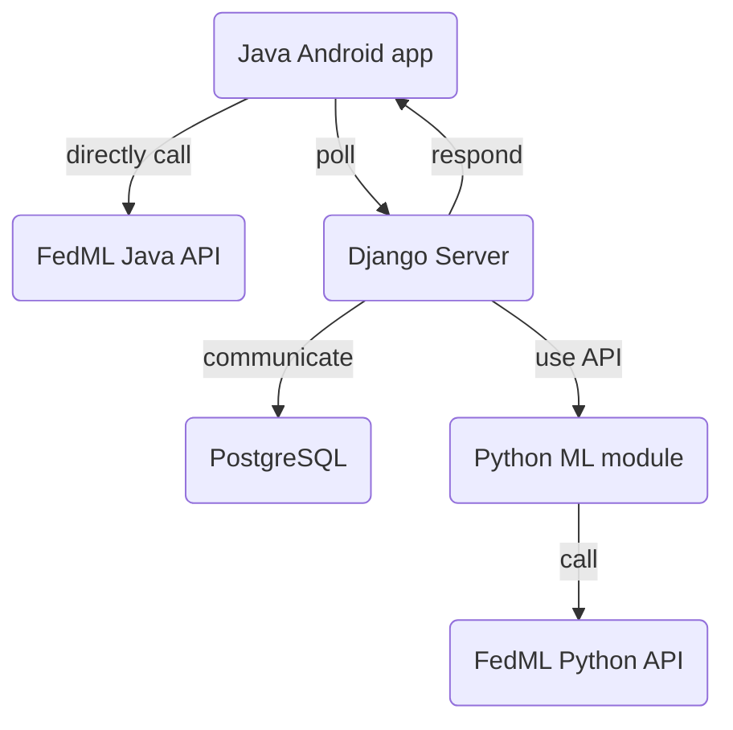

# Subwork\_Sichang

## TODOs

- [ ] Make a POC with `flwr`.
    - [ ] Test deploy w/ Johnny.
        - [ ] Map multiple ports to different subdomains.
        - [ ] HTTPS for backend server.
        - [ ] SSL for Flower server.
        - [ ] Static file (`.tflite`) serving.
    - [ ] Server: smart scheduling.
- [ ] Simulation and physical benchmark system.

## Up till now

- Integrated `org.eu.fedcampus.train` into `FedCampus_APP`.
- Silly `simple_health_kit` model that predicts 3 classes of distance from 2
    input: steps and calories.
- `dyn_flower_android_drf` tracks `TrainingDataType` and advertise models
    accordingly.

## Up till 2023/6/8

- Meet with Aicha to overview `dyn_flower_android` and the customizations it
    provides for her federated learning.
    - Walk Aicha through the demo and the logic of the process.
- Meet with Johnny & Tianjun to specify deployment tasks.
- Integrating training package into FedCampus_APP with Beilong.
    - Created [MonoRepo][MonoRepo] to group FedCampus_APP and
        dyn_flower_android_drf together.
    - [Imported org.eu.fedcampus.train from dyn_flower_android_drf into
        FedCampus_APP](https://github.com/FedCampus/FedCampus_APP/commit/68a3444aa9e5ef4d4ab1e300beaf8b0f37e6010c).
    - Tested `tflite_convertor/convert_to_tflite.py` to verify that it is still
        able to generate the 5 `.tflite` files.
        - Failed to make the script run on my ARM Mac after trying multiple
            Python and Tensorflow versions.
        - [Opened an issue on the Flower repo](https://github.com/adap/flower/issues/1911)
            to address the breakage.
        - Got it running on Beilong's x86_64 Windows machine.
- Start to add telemetry to `org.eu.fedcampus.train`.
    - Togglable using an argument.
    - Sends client, session, and timing data to backend on training events.
- Persuaded Beilong to write nice commit messages and format code.

## Up till 2023/5/26

- [`dyn_flower_android` client side](https://github.com/FedCampus/dyn_flower_android_drf/pull/4):
    - Convert `flwr.android_client` from Java to Kotlin and use suspend
        functions.
    - Extract training functionality from `MainActivity` into
        `org.eu.fedcampus.train` to work towards a standalone library.
    - Upgraded `org.tensorflow:tensorflow-lite` dependency.
    - DB using [Room](https://developer.android.com/training/data-storage/room#kotlin).
        - Check if the models are already downloaded to prevent redownloading.
        - Restore user input on launch.
            - Needed [Room migration](https://developer.android.com/training/data-storage/room/migrating-db-versions).
            - Also needed to [store schema](https://stackoverflow.com/questions/44322178/room-schema-export-directory-is-not-provided-to-the-annotation-processor-so-we).
- `FedCampus_APP`:
    - [Discuss the need for better commit messages](https://github.com/FedCampus/FedCampus_APP/issues/4).
    - [Discuss Kotlin support](https://github.com/FedCampus/FedCampus_APP/issues/3).

        <details>

        Currently, Beilong is writing this App in Java because he is more
        productive in Java.
        I suggest that we want the null safety from Kotlin and we will probably
        need to migrate to Kotlin, at least partially, when we want to use
        suspend functions.

        </details>

## Up till 2023/5/18

- Started [dyn_flower_android_drf](https://github.com/SichangHe/dyn_flower_android_drf)
    - Django REST server serve TFLite model files and their information.
    - Android client ask for TFLite model files, download them onto disk,
        and start `FlowerClient` using the model downloaded.
        - Implemented to load model anywhere on disk instead of in `assets/`:
            `org/tensorflow/lite/examples/transfer/api/ExternalModelLoader.kt`.
    - Django server launch Flower server in background process.
        - Studied Selery, Huey, and APScheduler, and landed on using
            `multiprocessing` directly.
    - Tried saving model parameters in the background Flower process using a
        custom `Strategy`, but it does not work because
        `django.core.exceptions.AppRegistryNotReady: Apps aren't loaded yet.`.
    - Spawn a new process for each server requested.
        - Spawn a thread to monitor it so that it could save the parameters
            to DB.
        - Restore old parameters from DB at Flower server start.

## Up till 2023/4/21

- `flower` uses `protobuf` to *generate* language-specific gRPC stub code.
- In Android example, the TFLite model is hard-coded:
    - Data parsing functions have data semantics hard-coded and
        and run at data load.
    - No encoded way to transfer model (`.tflite`) files.
    - The TFLite API used (`TransferLearningModel`) is model-agnostic.
        Potential to easily swap models.
- Consider an extra connection layer in front of `flower`.
    - `flower` has sophisticated gRPC configuration—hard to fiddle with.
    - Keeping `flower` contained and in one piece is beneficial for future
        compatibility.
    - Can use Django to spawn flower servers and reverse proxy to them.
    - Consider using Django to spawn flower servers on new ports,
        and tell clients to connect to them at the ports.

## Up till 2023/04/10

- Study how `flower` works.
    - The `strategy` handles most custom logic on server side.
    - Order of connection and training managed/hardcoded.
        - Start training after connection established.
        - No resume.
        - No sleep option.

<details>
<summary>Stack of abstractions for Flower Android demo.</summary>

Server.

- `GrpcBridge` in `server/grpc_server/grpc_bridge.py`, `common/serde`.
- `GrpcClientProxy(ClientProxy)` in `server/grpc_server/grpc_client_proxy.py`.
- `fit_client` in `server/server.py`.
- `Server` in `server/server.py`.
- `run_server` in `server/app.py`.

gRPC server.

- `FlowerServiceServicer(transport_pb2_grpc.FlowerServiceServicer)`
    in `server/grpc_server/flower_service_servicer.py`.
- `start_grpc_server` in `server/grpc_server/grpc_server.py`.

Android client gRPC client.

- `FlowerServiceGrpc` defined in `proto/transport.proto`.
- `FlowerServiceRunnable`.
- `runGrpc`.

</details>

## Up till 2023/04/04

- [Repo: Android MQTT Django POC](https://github.com/SichangHe/Android_MQTT_django_POC)

    Sketch POC of the whole structure without on-device training.
    - MQTT client on Django connecting to Johnny's deployed broker following
        [How to Use MQTT in The Django Project](https://www.emqx.com/en/blog/how-to-use-mqtt-in-django).
    - MQTT client on Android following [example in
        eclipse/paho.mqtt.java](https://github.com/eclipse/paho.mqtt.java/blob/f4e0db802a4433645ef011e711646a09ec9fae89/org.eclipse.paho.sample.mqttv3app/src/main/java/org/eclipse/paho/sample/mqttv3app/Sample.java#L50).
        - Subscribe to topic.
        - Publish content in EditText input box.

<details>
<summary>Looked up mobile ML framework comparisons.</summary>

- Tensorflow Lite was benchmarked to be a few times faster than PyTorch Mobile.
    [Comparison and Benchmarking of AI Models and Frameworks on Mobile Devices](https://arxiv.org/pdf/2005.05085.pdf).
- [A Comprehensive Benchmark of Deep Learning Libraries on Mobile Devices](https://xumengwei.github.io/files/WWW22-MobileDLLibs.pdf):
    - No clear winner on neither CPU nor GPU. ncnn is generally fastest.
    - PyTorch Mobile did not have GPU support.
- [On-Device Deep Learning: PyTorch Mobile and TensorFlow Lite](https://www.kdnuggets.com/2021/11/on-device-deep-learning-pytorch-mobile-tensorflow-lite.html):
    - PyTorch Mobile and PyTorch share codebase, no conversion problem.
    - TFLite and Tensorflow are difference codebase,
        use care when choosing operators for models.

</details>

- Tried out [Flower](https://flower.dev)
    - Fairly maintained and well documented.
    - Worked out of the box.
    - Uses TFLite for Android.
    - Uses gRPC.

<details>
<summary>Tried out other mobile machine learning frameworks.</summary>

- MNN

    Their Android demo is extremely old, buggy, and does not work.
    The setup is long but simple.
- TensorFlow Lite
    - [Outdated tutorial](https://www.tensorflow.org/lite/examples/on_device_training/overview).
        - The basics have not changed, though.
    - [Up-to-date example](https://github.com/SichangHe/tensorflow--examples/tree/master/lite/examples/model_personalization/android).
        - Updated last week.
        - Builds and runs out of the box.
        - Uses Kotlin.
        - Lots of ceremonies doing simple things (1000 lines of Kotlin).
        - Training code is simple (at TransferLearningHelper.kt:training)
- Pytorch Mobile
    - Android demo also very old, but does work.
    - Updating their package works.
    - No on-device training support found.
- FedML
    - Workflow has to run on FedML servers.
    - Web GUI based.
    - Server-side implementation proprietary.
    - Client require full disk access.
    - Client only connects to FedML servers both via HTTPS and MQTT.

</details>

- Set up two Nova 9 for development.
    - It is just easier to set the language to English.
    - Tap `About phone` > `Build number` 7 times to [enter developer mode](https://www.youtube.com/watch?v=UQh9QJXoAOA).
    - `Developer options` is in `System & updates`.
        - Need to turn `USB debugging` on.
            - Need to log in to HUAWEI ID.

## Up till 2023/03/27

- Studied [FedML Android demo][fedml-android-demo].
    - Requires manually cloning MNN and configuring Cpp toolchain to build.
    - Uses JNI to call Cpp function from Java.
    - FedML wants you to use their platform as a service,
        register an account, connect your app to them and manage online.
    - Android SDK API documents are basically nonexistent.
- Read FedML Android SDK codebase because no documentation.

<details>
<summary>
The stack of abstraction layers for training from bottom to top.

Found the bottom by searching for `System.loadLibrary`.
</summary>

- `ai/fedml/edge/nativemobilenn/NativeFedMLClientManager.java`
    is the binding for MNN, the deep learning library in Cpp.
- `ai/fedml/edge/service/TrainingExecutor.java`
    is the higher level API for training.
- `ai/fedml/edge/service/ClientManager.java`
    handles both MQTT communication and training.
    Still has `TODO` comments in it.
- `ai/fedml/edge/service/ClientAgentManager.java`
    provides one "documented" method.
- `ai/fedml/edge/service/FedEdgeTrainImpl.java`
- `ai/fedml/edge/service/EdgeService.java`
    is made into a `Service`.
- `ai/fedml/edge/FedEdgeImpl.java`
    runs the service using an `Intent`.
- `ai/fedml/edge/FedEdgeManager.java`
    > This is the top APIs in FedML Android SDK,
    > it supports core training engine and related control commands
    > on your Android devices.

</details>

- Investigated FedML platform lock-in and cloud lock-in.

    Unfortunately, FedML Android SDK forces the users to use open.fedml.ai as a
    proxy for all MQTT traffic.
    - Forced MNN on Android

<details>
<summary>
Investigated using the same Machine Learning model on different platforms.
</summary>

[Open Neural Network Exchange (ONNX)][onnx] supports major Machine
Learning libraries.

- [Deploy ONNX](https://onnxruntime.ai/docs/tutorials/mobile/#develop-the-application)
- [Their runtimes](https://onnxruntime.ai)
- [Deploying Scikit-Learn Models In Android Apps With ONNX](https://towardsdatascience.com/deploying-scikit-learn-models-in-android-apps-with-onnx-b3adabe16bab)
    - The resulting models are small, and the process easy.
    - The parameters are hidden inside the model.
    - The training is done on Python, only inference is done on Android.
    - [Gather the common statistics from the ONNX models](https://github.com/microsoft/onnxruntime/issues/1820)
    - [How do you find the quantization parameter inside of the ONNX model resulted in converting already quantized tflite model to ONNX?](https://stackoverflow.com/questions/74229713/how-do-you-find-the-quantization-parameter-inside-of-the-onnx-model-resulted-in)
- onnxruntime cannot train on mobile currently 😢: [ONNX Runtime Mobile Training
    (Android/iOS)](https://github.com/microsoft/onnxruntime/issues/11098).
    We would have to use a mobile framework anyway.

</details>

## Up till 2023/03/12

- Tried Retrofit and made blocking GET request not in strict mode.

<details>
<summary>Dependency settings.</summary>

```xml
<!-- AndroidManifest.xml -->
    <uses-permission android:name="android.permission.INTERNET" />
    <uses-permission android:name="android.permission.ACCESS_NETWORK_STATE" />
```

```gradle
// build.gradle
implementation 'com.squareup.retrofit2:retrofit:2.9.0'
implementation 'com.squareup.retrofit2:converter-gson:2.9.0'
implementation 'com.google.code.gson:gson:2.10.1'
```

</details>

- Tried Retrofit with [RxAndroid][RxAndroid] and [RxJava][RxJava] for
    non-blocking requests.

<details>
<summary>Using RxJava for non-blocking IO.</summary>

```gradle
// build.gradle
implementation 'io.reactivex.rxjava3:rxandroid:3.0.2'
implementation 'io.reactivex.rxjava3:rxjava:3.1.5'
```

```java
Flowable.fromCallable(someIoTaskFunction)
    .subscribeOn(Schedulers.io())
    .observeOn(AndroidSchedulers.mainThread())
    .subscribe(
        // What to do on the main thread after `someIoTaskFunction` returns.
        functionOnSuccess, functionOnFailure));
```

</details>

- Tried supporting Kotlin in existing Java app and calling Kotlin from Java.
    [Commit](https://github.com/SichangHe/learn_program/commit/563205ca8f812848391b6cfc5033a587707a7b16).
    [Answer on StackOverflow](https://stackoverflow.com/a/75702627/17800723).
    Very minimal changes and easy.
- Set up test repository
    [AndroidClient_django_server_POC][client-server-test-repo].
    - Android client was able to make GET request to the server.
- Set up fake JSON API.
    Made requests successfully both in Java test and on Android emulator.

<details>
<summary>JSON structures according to Jiaqi.</summary>

- POST

    ```json
    {
        "device_id": 0,
        "send_time": 104224314.342,
        "local_loss": 0.452,
        "local_weights": [0, 24, 5],
        "training_duration": 34.542
    }
    ```

- GET

    ```json
    {
        "configuration": {
            "learning_rate": 0.1
        },
        "send_time": 104224314.342,
        "global_weights": [34, 65, 7]
    }
    ```

</details>

<details>
<summary>Temporary solutions to enable local testing on Android emulator</summary>

- Allow HTTP requests.

    ```xml
    <!-- AndroidManifest.xml -->
    <application android:usesCleartextTraffic="true" …>
            …
    </application>
    ```

- Use localhost on emulators according to [Network address
    space](https://developer.android.com/studio/run/emulator-networking#networkaddresses).
- Allow localhost on Django server.

    ```python
    # django_server/settings.py
    ALLOWED_HOSTS = ["10.0.2.2"]
    ```

</details>

## Up till 2023/03/09

- Looked for Android HTTPS client resources.
    - [Perform network operations
        overview][perform-network-operations-overview] from Android developers.
    - ~~[Ktor][ktor] the Kotlin HTTPS client/server library.~~
    - Android HTTPS client [Retrofit][retrofit].
    - [android/connectivity-samples][android-connectivity-samples],
        a Git repository of code samples.

- Checked out the previous Android app `FedC`.
    - The app architecture is similar in Java, although the UI uses XML.
    - `org.eclipse.paho.client.mqttv3` handles MQTT.
    - The connection blocks the main thread, causing UI lag.
- Nuked Kotlin and related work out of the plan.
- Looked for Android developers tutorial for Java instead.
    - Hard to find because most are in Kotlin.

## Up till 2023/03/05

- Read FedML background materials.
- Ran FedML demo Python simulation.
- Tried Android Studio, Kotlin, JetPack Compose.
- Sketched tech stack plan for the Android platform.

<details>
<summary>Java + FedML Java API, Django + FedML Python API + PostgreSQL, HTTPS poll</summary>

Jiaqi asked me for a formal tech stack plan for the Android platform, here is my current sketch:

Android client app: Single Java app shipped to the user.

- Data gathering: UI, user data collection and handling, and HTTPS client in Java.
- ML: Call FedML's Java API for local training.

Server: Single modular Python server with single database.

- Python as language of choice to best support ML exploration.
- ML module:
    - Call FedML's Python API from the server for aggregation.
- Web module: gather and store data.
    - Django for HTTPS server and database interface (ORM).
    - PostgreSQL for database.

HTTPS does not support broadcasting, and we cannot assume that the clients would always be on. So, I assume that the clients will poll the server for new information ever so often. We only need to implement a REST API or something equivalent for the communication.



</details>

- Looked for full-duplex communication protocol as demanded by Jiaqi.

<details>
<summary>Need an external push service.</summary>

For [Push API][Push API], I only found [instruction to make push messages][make-push-message] which is for web apps. Unofficial instructions to make push messages to Android exist on [Intercom Developers][intercom-push-notifications] and [Iterable][iterable-push-notifications], both of which use Firebase for the push service.

My *conclusion* is that we should consider these after we have a working poll model because they involve external services.

</details>

[Push API]: https://developer.mozilla.org/docs/Web/API/Push_API
[make-push-message]: https://developers.google.com/learn/pathways/pwa-push-notifications
[intercom-push-notifications]: https://developers.intercom.com/installing-intercom/docs/react-native-push-notifications
[iterable-push-notifications]: https://support.iterable.com/hc/en-us/articles/115000331943-Setting-up-Android-Push-Notifications-#_1-set-up-firebase-for-your-android-app
[perform-network-operations-overview]: https://developer.android.com/training/basics/network-ops
[ktor]: https://ktor.io
[android-connectivity-samples]: https://github.com/android/connectivity-samples
[retrofit]: https://square.github.io/retrofit/
[RxAndroid]: https://github.com/ReactiveX/RxAndroid
[RxJava]: https://github.com/ReactiveX/RxJava
[client-server-test-repo]: https://github.com/SichangHe/AndroidClient_django_server_POC
[fedml-android-demo]: https://doc.fedml.ai/cross-device/examples/cross_device_android_example.html
[MonoRepo]: https://github.com/FedCampus/MonoRepo
[onnx]: https://onnx.ai
