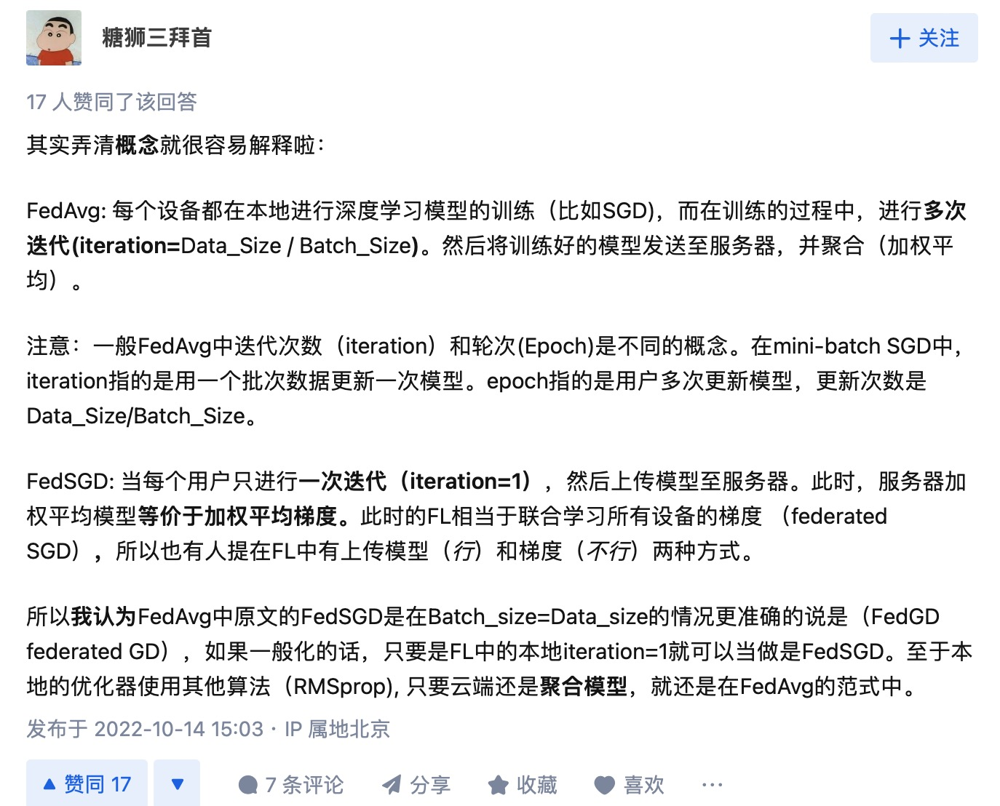

# Notes: *Communication-Efficient Learning of Deep Networks from Decentralized Data*

Read Time: 20230606

Link: https://arxiv.org/pdf/1602.05629.pdf

This is the first Federated Learning paper, and was often mentioned in those project sent to me.

## Abstract

This paper presents a practical method for the federated learning of deep networks based on iterative modal averaging, and conduct an extensive empirical evaluation. These experiments demonstrate the approach is robust to the **unbalanced and non-IID** data. Commu- nication costs are the principal constraint.

## Introduction

### Federated Learning

1) Training on real-world data from mobile devices provides a distinct advantage over training on proxy data that is generally available in the data center. 
2) This data is privacy sensitive or large in size (compared to the size of the model), so it is preferable not to log it to the data center purely for the purpose of model training (in service of the *focused collection* principle). 
3) For supervised tasks, labels on the data can be inferred naturally from user interaction.

### Privacy

They'll briefly discuss the possibility of combining federated learning with secure multiparty computation and differential privacy.

### Federated Optimization

**Chanllenges**

- Non-IID
- Unbalanced Similarly, some users will make much heavier use
- Massively distributed: We expect the number of clients participating in an optimization to be much larger than the average number of examples per client.
- Limited communication

**Some issues beyond consideration**

- client datasets that change as data is added and deleted; 
- client availability that correlates with the local data distribution in complex ways (e.g., phones from speakers of American English will likely be plugged in at different times than speakers of British English); 
- clients that never respond or send corrupted updates.

**Process**

Assume a synchronous update scheme that proceeds in rounds of communication. 

There is a fixed set of $K$ clients, each with a fixed local dataset. 

At the beginning of each round, a random fraction $C$ of clients is selected, and the server sends the current global algorithm state to each of these clients (e.g., the current model parameters). 

 Each selected client then performs local computation based on the global state and its local dataset, and sends an update to the server. The server then applies these updates to its global state, and the process repeats.

**Goal**

Take $f_i(w) = loss(x_i, y_i; w)$, that is, the loss of the prediction on example $(x_i, y_i)$ made with model parameters $w$.

$\min\limits_{w \isin R^d} f(w)$, where $f(w) = \sum\limits_{k=1}^{K}\frac{n_k}{n}F_k(w), F_k(w) = \frac{\sum\limits_{i \isin P_k}f_i(w)}{n_k}$

In IID data, $f(w) = E_{P_k}[F_k(w)]$

## The FederatedAveraging Algorithm

Starting from local SGD. This approach is computationally efficient, but requires very large numbers of rounds of training to produce good models.

State-of-the-art = master piece 杰作

**BaseLine: FedSGD**

Select $C$-fraction of clients, ($C = 1$ Corresponds to full-batch gradient descent).

When $C = 1$, with fixed learning rate $η$ and each clienet compute $g_k = \nabla{F_k}({w_t})$ central server aggregates the gradients and applies
$$
w_{t+1} ← w_{t} - \eta\sum\limits_{k=1}^{K}{\frac{n_k}{n}g_k}
$$
The amount of computation is controlled by three parameters:

$C$: the fraction of clients that perform computation on each round

$E$: then number of training passes each client makes over its local dataset on each round

$B$, the local minibatch size used for the client updates. We write $B = ∞$ to indicate that the full local dataset is treated as a single minibatch.

-->

## Experiment result

We study two ways of partitioning the MNIST data over clients: 

IID: where the data is shuffled, and then partitioned into $100$ clients each receiving $600$ examples

Non-IID: where we first *sort* the data by digit label, divide it into $200$ shards of size $300$, and assign each of $100$ clients $2$ shards.

\ 

I'll not record the data/result here, it is easy to find it by clicking into the link.

## Personal Note

-  What is the comparison between Convex and not?

  - **Convex Optimization**: In convex optimization problems, the objective function is convex, which means that any local optimal solution is also a global optimal solution. This makes convex optimization problems relatively easy to solve, as we can use various algorithms (such as gradient descent) to find the global optimal solution without worrying about getting stuck in local optimal solutions. However, many machine learning problems (including many problems in deep learning) are typically non-convex.
  - **Non-Convex Optimization**: In non-convex optimization problems, the objective function is non-convex, which means that there may be multiple local optimal solutions, and the global optimal solution may be difficult to find. Many optimization problems in deep learning are non-convex, as the loss functions of neural networks are typically non-convex. Although this makes optimization more difficult, we can still use various optimization techniques (such as stochastic gradient descent and its variants) to find good (although possibly not globally optimal) solutions.
  - In this paper, the authors focus primarily on non-convex neural network objectives. The FederatedAveraging algorithm they propose is applicable to any finite-sum objective, including non-convex objectives. Moreover, they discuss the challenges of using this method in a non-IID (independent and identically distributed) setting, which is a common issue in federated learning, as the data on each client may not be representative of the overall data distribution.

- What is the difference between FedAVG and FedSGD? (Zhihu)

  

- What is the baseline in the paper?
  - FedSGD is an optimization algorithm for federated learning. In each training round, it computes the gradients of the model based on the local data of each client, then sends these gradients to the server. The server averages these gradients and uses them to update the global model.
  - In the experimental section of the paper, the authors use FedSGD as a baseline to compare with their proposed Federated Averaging (FedAvg) algorithm. They find that for all three model classes (MNIST 2NN, MNIST CNN, and Shakespeare LSTM), FedAvg converges to a higher level of test-set accuracy than the baseline FedSGD models. This trend continues even if the lines are extended beyond the plotted ranges. For example, for the CNN, the B = ∞, E = 1 FedSGD model eventually reaches 99.22% accuracy after 1200 rounds (and had not improved further after 6000 rounds), while the B = 10, E = 20 FedAvg model reaches an accuracy of 99.44% after 300 rounds.
  - Furthermore, the authors also find that in addition to lowering communication costs, model averaging may produce a regularization benefit similar to that achieved by dropout.

